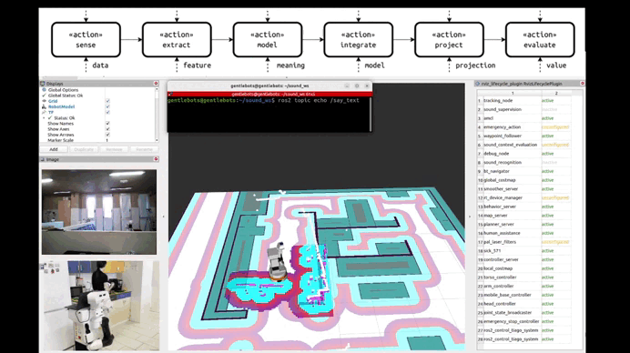

# sound_perception_system

The `sound_perception_system` is a ROS 2-based perception system that uses the ReSpeaker Mic Array 4 to capture sound. It integrates with the `sed_ros` package for real-time sound event classification. By leveraging the ReSpeaker, the system can obtain the Direction of Arrival (DOA) to localize sound on the robot's map. The system then categorizes the detected sounds into three types: environmental, supervised, or emergency.

## Installation

To install the `sound_perception_system` package, follow these steps:

```bash
cd ~/ros2_ws/src
git clone https://github.com/igonzf/sound_perception_system.git
```

### Dependencies

Before setting up the `sound_perception_system` package, you need to install the dependencies with the following command:

- `respeaker_ros` (for ReSpeaker Mic Array 4 support)
- `sed_ros` (for sound event classification)

```bash
vcs import --recursive < sound_perception_system/sound_perception_system/thirdparty.repos
```

## Build

```bash
cd ~/ros2_ws
colcon build
source ~/ros2_ws/install/setup.bash
```

## Usage

Before running `sound_perception_system`, make sure to launch the following dependencies:

```bash
ros2 run respeaker_ros respeaker_node
ros2 run sed_ros sed_detection
```

Then, to run the `sound_perception_system`, execute the following command:

```bash
ros2 run sound_perception_system sound_detection_main
```

## Demos

The system has been tested in three demo scenarios. Below you can find links to the videos for each demo:

### Demo 1: Supervised Sound with Human Presence



### Demo 2: Supervised Sound without Human Presence


### Demo 3: Emergency Sound


